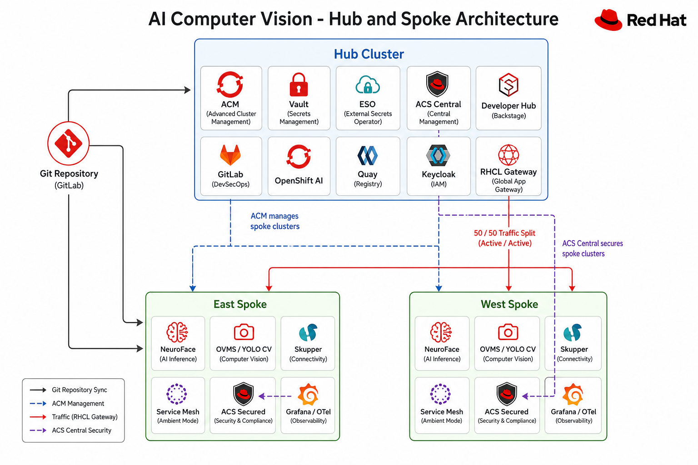
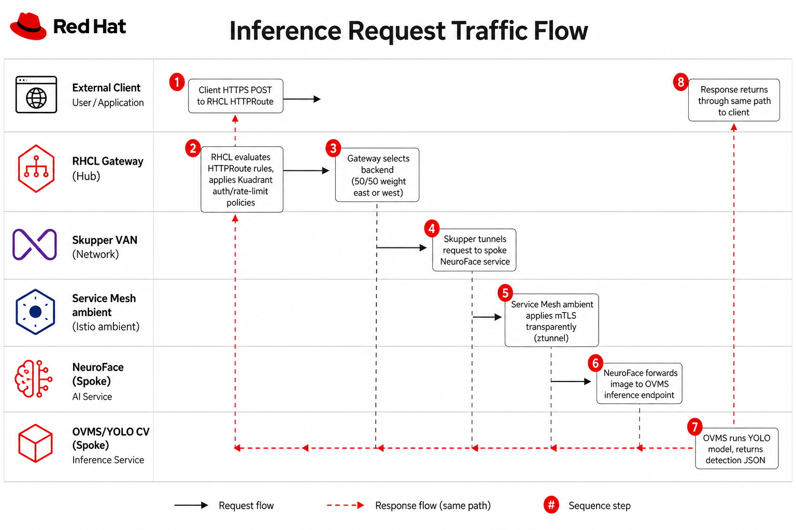
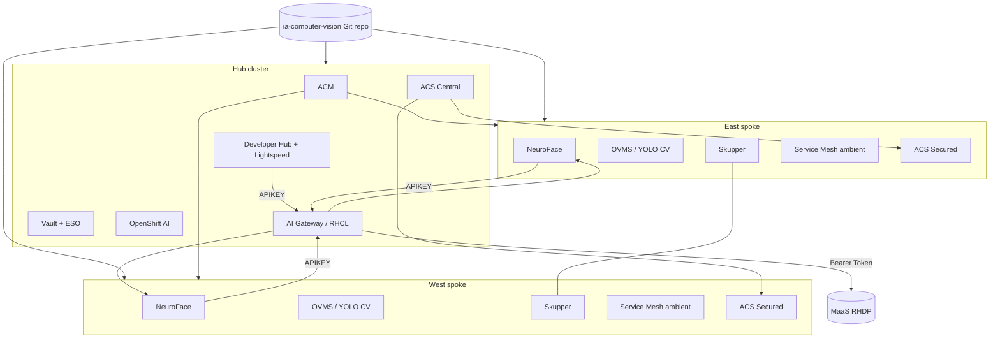

# AI Computer Vision

[](https://github.com/maximilianoPizarro/ia-computer-vision/actions/workflows/pages.yml)


Multi-cluster AI Computer Vision at the edge using Red Hat OpenShift, Validated Patterns GitOps, and hub-spoke fleet management.

**Full documentation:** [https://maximilianopizarro.github.io/ia-computer-vision/patterns/ia-computer-vision/](https://maximilianopizarro.github.io/ia-computer-vision/patterns/ia-computer-vision/)

## Business problem

Organizations deploying AI computer vision at distributed edge sites need:

- Consistent, auditable deployment of inference workloads across regions
- Secure connectivity between edge clusters and a central control plane
- Centralized observability, security policy, and developer self-service
- GitOps-driven lifecycle management without manual cluster configuration

## Solution

The **AI Computer Vision** Validated Pattern deploys a three-cluster architecture:

| Cluster | Role | Key components |
|---------|------|----------------|
| **Hub** | Fleet control plane | ACM, Vault, ESO, ACS Central, RHCL gateway, GitLab, Developer Hub, OpenShift AI, Keycloak |
| **East spoke** | Edge inference | NeuroFace, OVMS/YOLO CV, Skupper, Service Mesh ambient, ACS Secured, observability |
| **West spoke** | Edge inference | Same as east (load-balanced via RHCL 50/50 HTTPRoute) |

Install the pattern on each cluster with the Validated Patterns Operator or `./pattern.sh make install`, specifying `clusterGroupName: hub`, `east`, or `west`.

## What you will deploy

After a full installation you obtain:

- **Multi-cluster fleet management** — RHACM 2.16 registers east and west as managed clusters with GitOps-driven configuration
- **Centralized secrets** — Vault with ESO backing GitLab, Keycloak, Developer Hub, and application secrets
- **Unified security** — RHACS Central on the hub with Secured Cluster sensors on every spoke
- **External inference gateway** — RHCL HTTPRoute with 50/50 load balancing to east and west NeuroFace backends
- **Edge computer vision** — NeuroFace application with OVMS/YOLO PPE detection on each spoke
- **Cross-cluster connectivity** — Skupper Service Interconnect linking hub and spoke services
- **Service mesh telemetry** — OpenShift Service Mesh 3.2 ambient mode without sidecar injection
- **Developer platform** — GitLab, Developer Hub (AI CV software template, Red Hat Developer Lightspeed, OpenShift DevSpaces), Keycloak
- **AI platform** — OpenShift AI 3.4 with native **Models as a Service** (Gen AI Studio, MaaS gateway) plus Kuadrant **AI Gateway** as a parallel proxy path
- **GitOps MCP** — `mcp-for-argocd` on the hub for multi-cluster Argo CD queries (OpenShift Lightspeed client)
- **Observability** — Grafana, OpenTelemetry, Kiali, and Thanos federation across clusters
- **Workshop mode (default)** — 30 HTPasswd users, Showroom lab guide with embedded terminal

## Product version matrix

| Product | Version | Channel | Purpose |
|---------|---------|---------|---------|
| Red Hat OpenShift Container Platform | 4.20+ | — | Platform for hub and spoke clusters |
| Red Hat Advanced Cluster Management | 2.16 | `release-2.16` | Fleet management and spoke import |
| Red Hat OpenShift GitOps | — | — | GitOps reconciliation (installed by VP Operator) |
| Red Hat Advanced Cluster Security | 4.x | `stable` | Central + Secured Cluster security |
| Red Hat Connectivity Link | — | `stable` | Gateway API ingress and Kuadrant policies |
| Red Hat OpenShift AI | 3.4 | `stable-3.4` | Model serving and data science platform |
| Red Hat OpenShift Service Mesh | 3.2 | `stable-3.2` | Ambient mesh mTLS and telemetry |
| Red Hat Developer Hub | — | `fast` | Developer portal and scaffolder |
| Red Hat Build of Keycloak | 26.4 | `stable-v26.4` | OIDC identity provider + per-user biometric RHBK |
| GitLab Operator | — | `stable` | Source control and CI/CD |
| OpenShift Pipelines | — | `latest` | CI/CD pipelines on hub |
| OpenShift DevSpaces | — | `stable` | Cloud IDE workspaces |
| External Secrets Operator | 1.x | `stable-v1` | Vault-to-Kubernetes secret sync |
| Skupper | 2.x | `stable-2` | Cross-cluster application connectivity |
| Cluster Observability Operator | — | `stable` | Grafana and monitoring CRDs |
| OpenTelemetry | — | `stable` | Distributed tracing collectors |
| AMQ Streams | — | `stable` | Event streaming on spokes |

Channels reflect `values-hub.yaml` and `values-east.yaml` subscription definitions.

## Architecture







## Prerequisites

- Three Red Hat OpenShift Container Platform 4.20+ clusters (hub, east, west)
- Hub cluster: 3× `m6a.2xlarge` control plane + 3× **`m6a.4xlarge`** workers (16 vCPU, 64 GiB). For sandbox/demo, `m6a.2xlarge` works with [reduced resource requests](https://maximilianopizarro.github.io/ia-computer-vision/patterns/ia-computer-vision/cluster-sizing/)
- Spoke clusters: 3× `m6a.2xlarge` control plane + 3× `m6a.2xlarge` workers
- Validated Patterns Operator installed on each cluster
- `podman` and cluster admin `kubeconfig` for CLI install
- Image builds use the OpenShift internal registry (no external Quay required)

## Quick start (hub-last install order)

Install east and west spokes first, then the hub last. This allows automatic RHACM spoke import via Vault tokens.

### 1. East spoke

```bash
export TARGET_CLUSTERGROUP=east
./pattern.sh make install
```

### 2. West spoke

```bash
export TARGET_CLUSTERGROUP=west
./pattern.sh make install
```

### 3. Collect spoke tokens

The pattern automatically creates a `acm-import` ServiceAccount with `cluster-admin` in `kube-system` on each spoke (via the `platform-users` chart at wave 0). You only need to generate the token:

```bash
# On each spoke — generate a long-lived token (SA is created by the pattern)
oc create token -n kube-system acm-import --duration=87600h
oc whoami --show-server
```

Add the tokens to `~/values-secret-ia-computer-vision.yaml` under `spoke-credentials`.

### 4. Hub cluster

```bash
./pattern.sh make install
# Uses values-global.yaml (clusterGroupName: hub)
```

Or create a Pattern CR directly from the OCP Console (**Operators → Installed Operators → Validated Patterns Operator → Pattern → Create Pattern**):

```yaml
apiVersion: gitops.hybrid-cloud-patterns.io/v1alpha1
kind: Pattern
metadata:
  name: ia-computer-vision
  namespace: openshift-operators
spec:
  clusterGroupName: hub
  gitSpec:
    targetRepo: https://github.com/maximilianoPizarro/ia-computer-vision.git
    targetRevision: main
  multiSourceConfig:
    enabled: true
    clusterGroupChartVersion: "0.9.*"
    helmRepoUrl: https://charts.validatedpatterns.io
  extraParameters:
    - name: spokeCredentials.mode
      value: inline
    - name: spokeCredentials.clusters.east.token
      value: "<EAST_SA_TOKEN>"
    - name: spokeCredentials.clusters.east.apiUrl
      value: "https://api.<EAST_DOMAIN>:6443"
    - name: spokeCredentials.clusters.west.token
      value: "<WEST_SA_TOKEN>"
    - name: spokeCredentials.clusters.west.apiUrl
      value: "https://api.<WEST_DOMAIN>:6443"
```

Replace `<EAST_SA_TOKEN>`, `<WEST_SA_TOKEN>`, `<EAST_DOMAIN>`, and `<WEST_DOMAIN>` with the values collected in step 3. Also set the same east/west API URLs in `values-hub.yaml` under `clusterGroup.applications.developer-hub.overrides` (`spokeCredentials.clusters.*.apiUrl`) before hub install.

For spokes, create the same CR replacing `clusterGroupName: hub` with `east` or `west` and omitting `extraParameters`.

**Hub-only GPU on a single-node sandbox** (e.g. RHPDS `g6.12xlarge`): the single node is both control plane and worker, and its default 250 max-pods kubelet limit is easily exhausted by the control plane + RHACM + Pipelines + RHOAI + GPU Operator baseline alone (hardware is not the constraint — a `g6.12xlarge` has 48 vCPU / 192 GiB free). **Before installing**, raise `maxPods` via `KubeletConfig` (see [Cluster sizing](https://maximilianopizarro.github.io/ia-computer-vision/patterns/ia-computer-vision/cluster-sizing/#single-node-rhpds-sandboxes-eg-g612xlarge-gpu-demo) — this reboots the node, 5-15 min), then add these overlays:

```yaml
  extraValueFiles:
    - /values-hub-gpu.yaml
    - /values-hub-single-node.yaml
    - /values-hub-rhpds.yaml
    - /values-hub-only.yaml
```

`values-hub-rhpds.yaml` aligns the Service Mesh subscription channel and skips duplicate OperatorGroups for namespaces RHPDS pre-provisions (`openshift-nfd`, `nvidia-gpu-operator`, `redhat-ods-operator`), and exposes the RHOAI catalog's pre-installed `llama-32-3b-instruct` demo model through the workshop Kuadrant API gateway (`/llama`, same API-key UX as the other demo APIs). `values-hub-only.yaml` disables Skupper/ACM spoke import for a hub without east/west spokes.

With `maxPods` raised, GitLab, Developer Hub, DevSpaces, and RHBK all fit alongside GPU model serving. If `maxPods` cannot be changed (immutable sandbox), add `/values-hub-gpu-minimal.yaml` as a fifth overlay to disable those and keep only Vault/ESO + OpenShift AI + GPU serving.

The `acm-hub-spoke` chart (wave 6) auto-imports both spokes into RHACM using the inline tokens.

For step-by-step verification commands, see the [Getting started guide](https://maximilianopizarro.github.io/ia-computer-vision/patterns/ia-computer-vision/getting-started/).

## Secrets

### Option A — CLI install (`./pattern.sh make install`)

Copy the template and run the install. Secrets with `onMissingValue: generate` are auto-generated in Vault:

```bash
cp values-secret.yaml.template ~/values-secret-ia-computer-vision.yaml
# Edit ~/values-secret-ia-computer-vision.yaml to fill in spoke tokens and optional keys
./pattern.sh make install
```

### Option B — Console install (Pattern CR)

When you install via the OCP console, `make load-secrets` does not run. The `vault-secrets-bootstrap` chart (wave 3, hub only) automatically seeds `secret/hub/*` in Vault after Vault and ESO are ready — no manual steps required for a standard install.

If bootstrap was skipped or failed, load secrets manually after Vault initializes (wave 2):

```bash
# Generate passwords and load into Vault
oc exec vault-0 -n vault -- vault kv put secret/hub/gitlab-credentials \
  root-password="$(openssl rand -base64 16)" runner-token="$(openssl rand -base64 16)"

oc exec vault-0 -n vault -- vault kv put secret/hub/rhbk-credentials \
  admin-password="$(openssl rand -base64 16)" db-password="$(openssl rand -base64 16)"

oc exec vault-0 -n vault -- vault kv put secret/hub/developer-hub-secrets \
  oidc-client-secret="$(openssl rand -base64 24)" \
  session-secret="$(openssl rand -base64 32)" \
  gitlab-token="<GITLAB_PAT>"

oc exec vault-0 -n vault -- vault kv put secret/hub/ai-gateway-platform-keys \
  platformApiKey="$(openssl rand -base64 32)"

oc exec vault-0 -n vault -- vault kv put secret/hub/workshop-registration \
  adminToken="$(openssl rand -base64 24)"

oc exec vault-0 -n vault -- vault kv put secret/hub/minio-credentials \
  accesskey="$(openssl rand -base64 16)" secretkey="$(openssl rand -base64 24)"

oc exec vault-0 -n vault -- vault kv put secret/hub/keycloak-realm-clients \
  neuroface.user1.clientSecret="$(openssl rand -base64 24)" \
  neuroface.user2.clientSecret="$(openssl rand -base64 24)" \
  maas.user1.clientSecret="$(openssl rand -base64 24)" \
  cv.user1.clientSecret="$(openssl rand -base64 24)"

oc exec vault-0 -n vault -- vault kv put secret/hub/keycloak/realms/cv/backstage-provisioner \
  clientSecret="$(openssl rand -base64 24)"
```

| Secret | Fields | Required | Used by |
|--------|--------|----------|---------|
| `gitlab-credentials` | `root-password`, `runner-token` | Auto-generated | GitLab admin, CI runner |
| `rhbk-credentials` | `admin-password`, `db-password` | Auto-generated | Keycloak admin, PostgreSQL |
| `developer-hub-secrets` | `oidc-client-secret`, `session-secret`, `gitlab-token` | `oidc-client-secret` and `session-secret` auto-generated; `gitlab-token` set after GitLab deploys | RHDH OIDC, session, scaffolder |
| `ai-gateway-platform-keys` | `platformApiKey` | Auto-generated | Kuadrant API key for AI Gateway (used by Lightspeed and NeuroFace chat) |
| `workshop-registration` | `adminToken` | Auto-generated | Workshop self-registration app (Showroom) |
| `minio-credentials` | `accesskey`, `secretkey` | Auto-generated | NeuroFace CV model storage (overridden by GitLab's bundled Minio on spokes, see below) |
| `keycloak-realm-clients` | `neuroface.user1.clientSecret`, `neuroface.user2.clientSecret`, `maas.user1.clientSecret`, `cv.user1.clientSecret` | Auto-generated | Per-user Keycloak client secrets (`rhbk-iam` realms) |
| `keycloak/realms/cv/backstage-provisioner` | `clientSecret` | Auto-generated | Developer Hub Keycloak Admin REST provisioner (OIDC credentials self-service template) |
| `spoke-credentials` | `east-token`, `east-api-url`, `west-token`, `west-api-url` | Via Pattern CR `extraParameters` (inline mode) | ACM auto-import |

See [Validated Patterns secrets management](https://validatedpatterns.io/learn/secrets-management-in-the-validated-patterns-framework/).

## Workshop mode

Workshop mode is enabled by default with 30 pre-provisioned users (`user1`–`user30`, password `Welcome123!`) and a Showroom lab guide on the hub cluster.

| Component | Purpose |
|-----------|---------|
| `platform-users` | HTPasswd OAuth users + console RBAC (hub and spokes) |
| `developer-hub` / `gitlab-operator` / `devspaces` | Per-user Developer Hub, GitLab, and DevSpaces access |
| `showroom` | Antora lab guide with embedded `oc` terminal |

Access Showroom at `https://showroom-showroom.apps.<hub_domain>`. You can also [preview the workshop guide online](https://maximilianopizarro.github.io/ia-computer-vision-pages/modules/main/index.html) to see how the lab environment looks.

To change the number of users, update the `userCount` override in `values-hub.yaml`, `values-east.yaml`, and `values-west.yaml`. See [Workshop mode documentation](https://maximilianopizarro.github.io/ia-computer-vision/patterns/ia-computer-vision/workshop/).

## Documentation

| Topic | Link |
|-------|------|
| Pattern overview | [Documentation home](https://maximilianopizarro.github.io/ia-computer-vision/patterns/ia-computer-vision/) |
| Getting started | [Install and verify](https://maximilianopizarro.github.io/ia-computer-vision/patterns/ia-computer-vision/getting-started/) |
| Architecture | [Topology and traffic flow](https://maximilianopizarro.github.io/ia-computer-vision/patterns/ia-computer-vision/architecture/) |
| Scaffolding and secrets | [Software template and Vault/ESO flows](https://maximilianopizarro.github.io/ia-computer-vision/patterns/ia-computer-vision/scaffolding-and-secrets/) |
| Troubleshooting | [Common issues](https://maximilianopizarro.github.io/ia-computer-vision/patterns/ia-computer-vision/troubleshooting/) |
| Customization | [Extension ideas](https://maximilianopizarro.github.io/ia-computer-vision/patterns/ia-computer-vision/ideas-for-customization/) |

Local preview:

```bash
cd docs && make serve
```

## Maintainer

**Maximiliano Pizarro** — Specialist Solution Architect — [mapizarr@redhat.com](mailto:mapizarr@redhat.com)

## License

Apache License 2.0 — see [LICENSE](LICENSE).

## Support

See [SUPPORT.md](SUPPORT.md).
