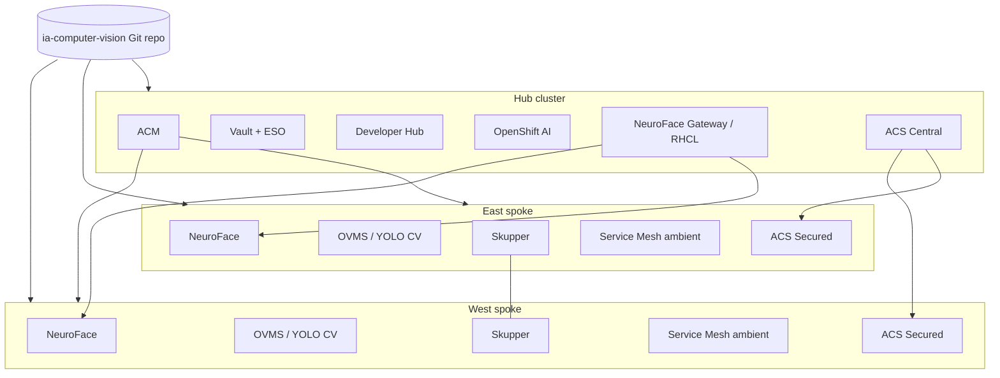

# AI Computer Vision

[](https://github.com/maximilianoPizarro/ia-computer-vision/actions/workflows/pages.yml)


Multi-cluster AI Computer Vision at the edge using Red Hat OpenShift, Validated Patterns GitOps, and hub-spoke fleet management.

**Full documentation:** [https://maximilianopizarro.github.io/ia-computer-vision/patterns/ia-computer-vision/](https://maximilianopizarro.github.io/ia-computer-vision/patterns/ia-computer-vision/)

## Business problem

Organizations deploying AI computer vision at distributed edge sites need:

- Consistent, auditable deployment of inference workloads across regions
- Secure connectivity between edge clusters and a central control plane
- Centralized observability, security policy, and developer self-service
- GitOps-driven lifecycle management without manual cluster configuration

## Solution

The **AI Computer Vision** Validated Pattern deploys a three-cluster architecture:

| Cluster | Role | Key components |
|---------|------|----------------|
| **Hub** | Fleet control plane | ACM, Vault, ESO, ACS Central, RHCL gateway, GitLab, Developer Hub, OpenShift AI, Quay, Keycloak |
| **East spoke** | Edge inference | NeuroFace, OVMS/YOLO CV, Skupper, Service Mesh ambient, ACS Secured, observability |
| **West spoke** | Edge inference | Same as east (load-balanced via RHCL 50/50 HTTPRoute) |

Install the pattern on each cluster with the Validated Patterns Operator or `./pattern.sh make install`, specifying `clusterGroupName: hub`, `east`, or `west`.

## What you will deploy

After a full installation you obtain:

- **Multi-cluster fleet management** — RHACM 2.16 registers east and west as managed clusters with GitOps-driven configuration
- **Centralized secrets** — Vault with ESO backing GitLab, Keycloak, Developer Hub, and application secrets
- **Unified security** — RHACS Central on the hub with Secured Cluster sensors on every spoke
- **External inference gateway** — RHCL HTTPRoute with 50/50 load balancing to east and west NeuroFace backends
- **Edge computer vision** — NeuroFace application with OVMS/YOLO PPE detection on each spoke
- **Cross-cluster connectivity** — Skupper Service Interconnect linking hub and spoke services
- **Service mesh telemetry** — OpenShift Service Mesh 3.2 ambient mode without sidecar injection
- **Developer platform** — GitLab, Developer Hub (AI CV software template), OpenShift DevSpaces, Quay, Keycloak
- **AI platform** — OpenShift AI 3.4 DataScienceCluster on the hub for model serving workflows
- **Observability** — Grafana, OpenTelemetry, Kiali, and Thanos federation across clusters
- **Workshop mode (default)** — 30 HTPasswd users, Showroom lab guide with embedded terminal

## Product version matrix

| Product | Version | Channel | Purpose |
|---------|---------|---------|---------|
| Red Hat OpenShift Container Platform | 4.20+ | — | Platform for hub and spoke clusters |
| Red Hat Advanced Cluster Management | 2.16 | `release-2.16` | Fleet management and spoke import |
| Red Hat OpenShift GitOps | — | — | GitOps reconciliation (installed by VP Operator) |
| Red Hat Advanced Cluster Security | 4.x | `stable` | Central + Secured Cluster security |
| Red Hat Connectivity Link | — | `stable` | Gateway API ingress and Kuadrant policies |
| Red Hat OpenShift AI | 3.4 | `stable-3.4` | Model serving and data science platform |
| Red Hat OpenShift Service Mesh | 3.2 | `stable-3.2` | Ambient mesh mTLS and telemetry |
| Red Hat Developer Hub | — | `fast` | Developer portal and scaffolder |
| Red Hat Build of Keycloak | 26.4 | `stable-v26.4` | OIDC identity provider |
| Red Hat Quay | 3.17 | `stable-3.17` | Private container registry |
| GitLab Operator | — | `stable` | Source control and CI/CD |
| OpenShift Pipelines | — | `latest` | CI/CD pipelines on hub |
| OpenShift DevSpaces | — | `stable` | Cloud IDE workspaces |
| External Secrets Operator | 1.x | `stable-v1` | Vault-to-Kubernetes secret sync |
| Skupper | 2.x | `stable-2` | Cross-cluster application connectivity |
| Cluster Observability Operator | — | `stable` | Grafana and monitoring CRDs |
| OpenTelemetry | — | `stable` | Distributed tracing collectors |
| AMQ Streams | — | `stable` | Event streaming on spokes |

Channels reflect `values-hub.yaml` and `values-east.yaml` subscription definitions.

## Architecture




## Prerequisites

- Three Red Hat OpenShift Container Platform 4.20+ clusters (hub, east, west)
- Recommended AWS sizing per cluster: 3× `m6a.2xlarge` control plane + 3× `m6a.2xlarge` workers (see [cluster sizing](https://maximilianopizarro.github.io/ia-computer-vision/patterns/ia-computer-vision/cluster-sizing/))
- Validated Patterns Operator installed on each cluster
- `podman` and cluster admin `kubeconfig` for CLI install

## Quick start

### Hub cluster

```bash
./pattern.sh make install
# Uses values-global.yaml (clusterGroupName: hub)
```

Or create a Pattern CR with `clusterGroupName: hub` pointing to this repository.

### East spoke

```bash
export TARGET_CLUSTERGROUP=east
./pattern.sh make install
```

### West spoke

```bash
export TARGET_CLUSTERGROUP=west
./pattern.sh make install
```

For step-by-step verification commands, see the [Getting started guide](https://maximilianopizarro.github.io/ia-computer-vision/patterns/ia-computer-vision/getting-started/).

## Secrets

Copy `values-secret.yaml.template` to `~/values-secret-ia-computer-vision.yaml` and fill in optional values. See [Validated Patterns secrets management](https://validatedpatterns.io/learn/secrets-management-in-the-validated-patterns-framework/).

## Workshop mode

Workshop mode is enabled by default with 30 pre-provisioned users (`user1`–`user30`, password `Welcome123!`) and a Showroom lab guide on the hub cluster.

| Component | Purpose |
|-----------|---------|
| `platform-users` | HTPasswd OAuth users + console RBAC (hub and spokes) |
| `developer-hub` / `gitlab-operator` / `devspaces` | Per-user Developer Hub, GitLab, and DevSpaces access |
| `showroom` | Antora lab guide with embedded `oc` terminal |

Access Showroom at `https://showroom-showroom.apps.<hub_domain>`.

To change the number of users, update the `userCount` override in `values-hub.yaml`, `values-east.yaml`, and `values-west.yaml`. See [Workshop mode documentation](https://maximilianopizarro.github.io/ia-computer-vision/patterns/ia-computer-vision/workshop/).

## Documentation

| Topic | Link |
|-------|------|
| Pattern overview | [Documentation home](https://maximilianopizarro.github.io/ia-computer-vision/patterns/ia-computer-vision/) |
| Getting started | [Install and verify](https://maximilianopizarro.github.io/ia-computer-vision/patterns/ia-computer-vision/getting-started/) |
| Architecture | [Topology and traffic flow](https://maximilianopizarro.github.io/ia-computer-vision/patterns/ia-computer-vision/architecture/) |
| Troubleshooting | [Common issues](https://maximilianopizarro.github.io/ia-computer-vision/patterns/ia-computer-vision/troubleshooting/) |
| Customization | [Extension ideas](https://maximilianopizarro.github.io/ia-computer-vision/patterns/ia-computer-vision/ideas-for-customization/) |

Local preview:

```bash
cd docs && make serve
```

## Maintainer

**Maximiliano Pizarro** — Specialist Solution Architect — [mapizarr@redhat.com](mailto:mapizarr@redhat.com)

## License

Apache License 2.0 — see [LICENSE](LICENSE).

## Support

See [SUPPORT.md](SUPPORT.md).
