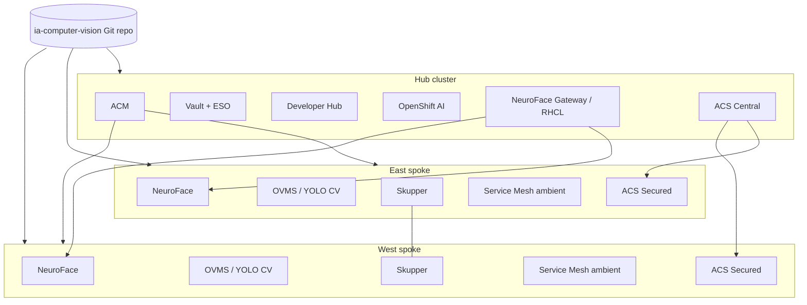

# AI Computer Vision Validated Pattern

Multi-cluster AI Computer Vision at the edge using Red Hat OpenShift, Validated Patterns GitOps, and hub-spoke fleet management.

## Business problem

Organizations deploying AI computer vision at distributed edge sites need:

- Consistent, auditable deployment of inference workloads across regions
- Secure connectivity between edge clusters and a central control plane
- Centralized observability, security policy, and developer self-service
- GitOps-driven lifecycle management without manual cluster configuration

## Solution

The **AI Computer Vision** Validated Pattern deploys a three-cluster architecture:

| Cluster | Role | Key components |
|---------|------|----------------|
| **Hub** | Fleet control plane | ACM, Vault, ESO, ACS Central, RHCL gateway, GitLab, Developer Hub, OpenShift AI, Quay, Keycloak |
| **East spoke** | Edge inference | NeuroFace, OVMS/YOLO CV, Skupper, Service Mesh ambient, ACS Secured, observability |
| **West spoke** | Edge inference | Same as east (load-balanced via RHCL 50/50 HTTPRoute) |

Install the pattern on each cluster with the Validated Patterns Operator or `./pattern.sh make install`, specifying `clusterGroupName: hub`, `east`, or `west`.

## Architecture




## Prerequisites

- Three Red Hat OpenShift Container Platform 4.20+ clusters (hub, east, west)
- Recommended AWS sizing per cluster: 3× `m6a.2xlarge` control plane + 3× `m6a.2xlarge` workers (see [cluster sizing](docs/content/patterns/ia-computer-vision/cluster-sizing.adoc))
- Validated Patterns Operator installed on each cluster
- `podman` and cluster admin `kubeconfig` for CLI install

## Quick start

### Hub cluster

```bash
./pattern.sh make install
# Uses values-global.yaml (clusterGroupName: hub)
```

Or create a Pattern CR with `clusterGroupName: hub` pointing to this repository.

### East spoke

```bash
export TARGET_CLUSTERGROUP=east
./pattern.sh make install
```

### West spoke

```bash
export TARGET_CLUSTERGROUP=west
./pattern.sh make install
```

## Secrets

Copy `values-secret.yaml.template` to `~/values-secret-ia-computer-vision.yaml` and fill in optional values. See [Validated Patterns secrets management](https://validatedpatterns.io/learn/secrets-management-in-the-validated-patterns-framework/).

## Documentation

Full documentation is published at [https://maximilianopizarro.github.io/ia-computer-vision/](https://maximilianopizarro.github.io/ia-computer-vision/).

Local preview:

```bash
cd docs && make serve
```

## Maintainer

**Maximiliano Pizarro** — Specialist Solution Architect — [mapizarr@redhat.com](mailto:mapizarr@redhat.com)

## License

Apache License 2.0 — see [LICENSE](LICENSE).

## Support

See [SUPPORT.md](SUPPORT.md).
