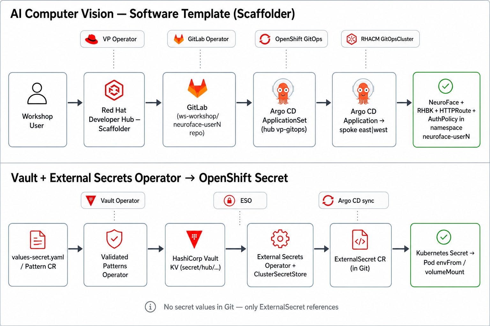

# AI Computer Vision software template

The **AI Computer Vision at the Edge** template provisions a personal NeuroFace instance on a spoke cluster with RHBK biometric OIDC, gateway routing, and GitOps deployment.



## What it is

A Red Hat Developer Hub **software template** (Backstage `Template` CR) that automates:

| Stage | What happens |
|-------|----------------|
| Form | You choose owner, spoke (`east` / `west`), and confirm hub/spoke domains. |
| Scaffolder | Skeleton is rendered and pushed to GitLab `ws-workshop/neuroface-<you>`. |
| Catalog | Entity `neuroface-<you>` appears with Kubernetes, Kiali, Tekton, GitLab, Argo CD, and Docs tabs. |
| GitOps | ApplicationSet on the hub creates an Argo CD Application targeting your spoke. |
| Runtime | Pods, RHBK, HTTPRoute, and AuthPolicy deploy in namespace `neuroface-<you>`. |

## Operators involved

| Operator / component | Role |
|---------------------|------|
| **Validated Patterns Operator** | Installs Developer Hub, GitLab, GitOps, ACM; injects domains into the template form. |
| **Developer Hub Scaffolder** | Runs `fetch:template`, `publish:github`, `catalog:register`. |
| **GitLab Operator** | Hosts the repo in group `ws-workshop`. |
| **OpenShift GitOps** | ApplicationSet `user-neuroface-apps` watches `^neuroface-` repos. |
| **RHACM GitOpsCluster** | Registers `east` / `west` with hub Argo CD so spoke sync works. |
| **Spoke charts** (`spoke-neuroface`, mesh, Kuadrant) | Shared gateway and PPE services your instance attaches to. |

## Run the template

1. Sign in to Developer Hub as your workshop user (`user1`, …).
2. Go to **Create** → **AI Computer Vision at the Edge**.
3. Set **Owner** to yourself.
4. Pick **Target spoke** — `east` (Kafka PPE alerts) or `west`.
5. Confirm **Hub cluster domain** and **Spoke cluster domain** (pre-filled by the platform).
6. Click **Create**.

## Expected result

After a successful run (typically 5–15 minutes for GitOps sync):

| Check | Expected |
|-------|----------|
| GitLab | Repo `https://gitlab.apps.<hub>/ws-workshop/neuroface-<you>` |
| Argo CD | Application `neuroface-<you>` in `vp-gitops`, destination `east` or `west` |
| Spoke pods | `neuroface-backend`, `neuroface-frontend`, `rhbk-neuroface-<you>` |
| Gateway | `https://neuroface-spoke-gateway.<spoke>/user/<you>/` (OIDC via RHBK) |
| RHBK admin | `https://rhbk-neuroface-<you>.<spoke>/admin` |
| Catalog | Entity with plugin tabs populated |

Verify from the hub:

```bash
oc get application -n vp-gitops neuroface-<you>
oc get pods -n neuroface-<you>  # use east/west kubeconfig or ACM console
```

## Scaffolder modules (template steps)

| Step ID | Action | Purpose |
|---------|--------|---------|
| `fetch` | `fetch:template` | Copy `ai-cv-skeleton` with your parameters. |
| `publish` | `publish:github` | Push to GitLab (uses PAT from Vault via ESO). |
| `register` | `catalog:register` | Register `catalog-info.yaml` in Developer Hub. |

Output links in the template UI point to repository, NeuroFace gateway, RHBK admin, DevSpaces, and catalog entity.

## Prerequisites (platform team)

- GitLab PAT in Vault: `secret/hub/developer-hub-secrets` → `gitlab-token`
- GitOpsCluster registered east/west cluster secrets in `vp-gitops`
- `spoke-neuroface` and `spoke-neuroface-cv` healthy on target spoke

See [Vault and ESO secrets](vault-eso-secrets.md) for how credentials reach OpenShift.

## Related

- [Vault and ESO secrets](vault-eso-secrets.md)
- [Login](login.md)
- [Kuadrant API keys (MaaS)](kuadrant-apis.md)
- Pattern docs: [Scaffolding and secrets](https://maximilianopizarro.github.io/ia-computer-vision/patterns/ia-computer-vision/scaffolding-and-secrets/)
